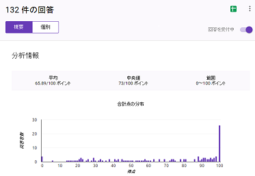
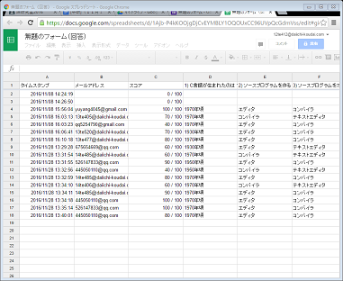

# Project Title
## Google Formを利用した授業管理システム

# Elevator Pitch

本研究は、授業管理システムの中に小テストの配信や成績管理を支援し、自らの学習活動を振り返って次につなげるような主体的な学習の過程を支援する。

# Description

本研究はGoogle Formを利用した授業管理システムである。                                                                                       
学内一部の授業に小テストの配信や成績管理、                                                                                                   
Google Formを利用した小テストの作成、配布、回収、分析を行い、                                                                               
教員側の負担の軽減することができた。

この課題は学生達の学び興味を引き起こし、学生の成績の向上する為に、アンケートを作るし、学生達の本音を聞いて、学生達の成績をしっかり分析する。
  成績概要分析は全体の成績合計点分布が表示できる。全体の平均値が表示できる。誤答の多い質問が表示できるなど。
図1は概要分析の画面である。

図1

フォームの回答はスプレッドシートに集計されるので、スプレッドシートから入力したデータを元にグラフを作成も可能である、フォームの編集画面から簡単にグラフで表示ができる。図2はフォームの回答スプレッドシートの画面である。

  図2

