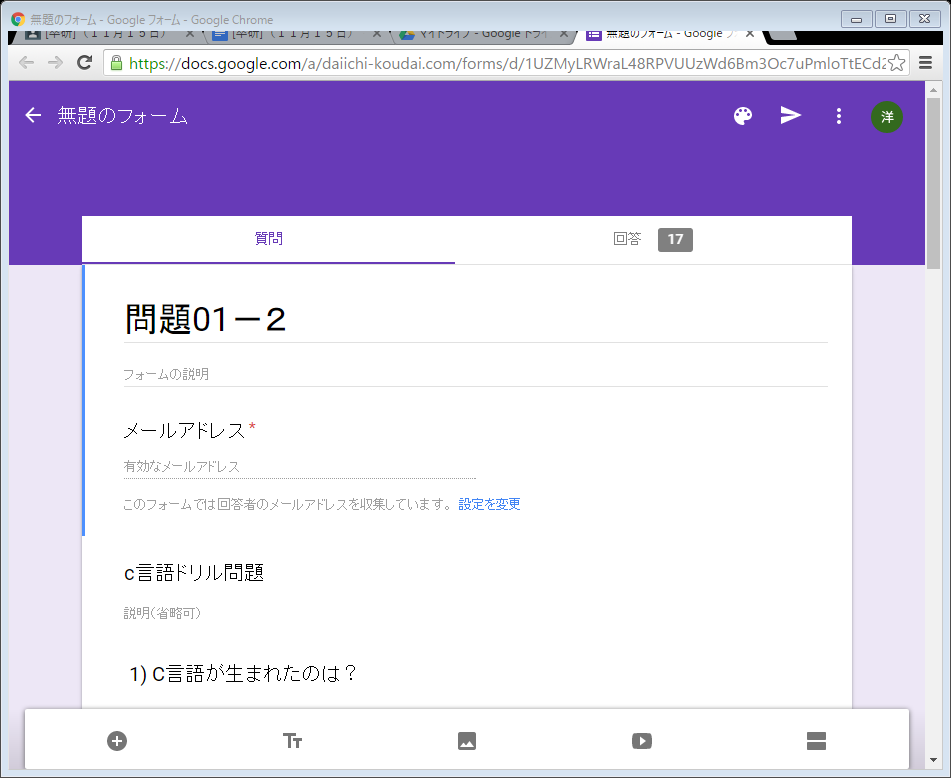
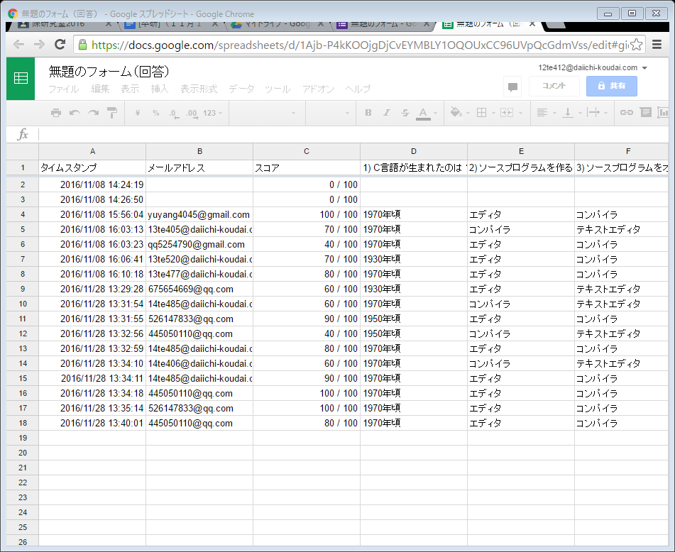
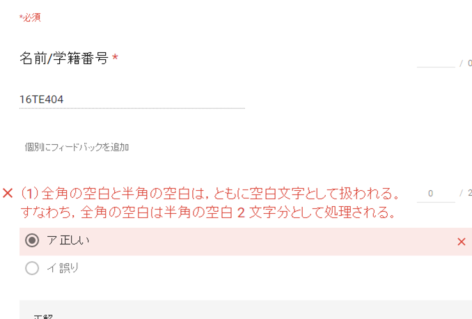

# Google Formを利用した授業管理システム

# 1.　背景

　大学の小テストは、知識の定着を促（うなが）すには欠（か）かせないものです。反復の機会を整（ととの）えるとともに、「思い出す練習の場」として、知識を思い出しやすいものに変えていく効果があります。
　現在、教員はテストの内容を作って、印刷して、学生達にテスト行って、テストを採点する。この後はテストの問題点や評価を学生にフィードバークする。
　受講学生が多い場合、小テストには時間がかかる。ICT技術を活用して、小テストを自動化すれば、時間と労力が節約できる。

# 2.　目的

本研究は、授業管理システムの中に小テストの配信や成績管理を支援し、自（みずか）らの学習活動を振り返って次につなげるような主体的な学習の過程を支援する。

# 3.　研究内容・方法

## （１）研究内容

授業管理システムはGoogle Classroomで構築し、中でGoogle Formを利用して小テスト実現する。

Google Formを利用した小テストの作成、配布、回収、分析プロセスの自動化を試（こころ）み、教員側の負担の軽減（けいげん）し、学生側の成績向上について考察する。

## (2) 研究方法
①フォームの作成

Google  Form作成新規作成アイコン ＋追加 をクリックします.新しいフォームが自動的に開きます。次はこのフォームのタイトルをつける。一番左上のフォーム名クリックしたらフォームタイトルと同じ名前にすることができます。このあど問いと回答を作る。図1はフォームを作るの画面である。

図１

## ②学生に配信する

oogle Classroom利用して配信する。学生たちをやってもらって成績を分析する。学生テスト繰り返し行って、以前の成績を比べて、成績向上かどうかわかる。図2は作ったフォームをClassroom中に配信画面である。

図２

## ③成績・概要分析

成績概要分析は全体の成績合計点分布が表示できる。全体の平均値が表示できる。誤答の多い質問が表示できるなど。
図3は概要分析の画面である。

図３

フォームの回答はスプレッドシートに集計されるので、スプレッドシートから入力したデータを元にグラフを作成も可能である、フォームの編集画面から簡単にグラフで表示ができる。図４はフォームの回答スプレッドシートの画面である。

図４

## ④成績・個別表示

成績個別分析は学生個別の成績表示できる。具体的の問題誤（あやま）っているのかを表示できる、また個別にフィードバークを追加できる。図５は個別表示の画面である。

図５

検索ボタンをクリックして、検索結果が出る。もし、この本が好きならば、本棚に入れるボタンをクリックすると、本棚に入れる。本棚で本を削除したいときに、本の表紙を長押しして、削除ができる。

# 4.　結果

本研究はGoogle Formを利用した授業管理システムである。学内一部の授業に小テストの配信や成績管理、また自らの学習活動を振り返って次につなげるような主体的な額手の過程を支援することができた。
　学生達の学び興味を引き起こすと成績の向上することがまだできない。

# 5.　結論

本研究は、Google Formを利用した小テストの作成、配布、回収、分析を行い、このシステムにより教員側の負担の軽減することができた。Google Formを利用したが授業管理システムに役に立ていた。
　今後の課題は学生達の学び興味を引き起こし、学生の成績の向上する為に、アンケートを作るし、学生達の本音を聞いて、学生達の成績をしっかり分析する。
  

