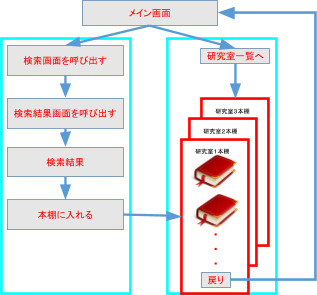
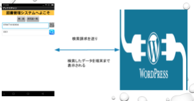
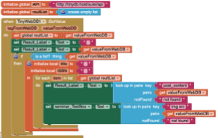
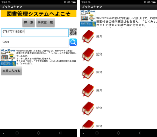

# Google Formを利用した授業管理システム

# 1.　背景

　大学の小テストは、知識の定着を促（うなが）すには欠（か）かせないものです。反復の機会を整（ととの）えるとともに、「思い出す練習の場」として、知識を思い出しやすいものに変えていく効果があります。
　現在、教員はテストの内容を作って、印刷して、学生達にテスト行って、テストを採点する。この後はテストの問題点や評価を学生にフィードバークする。
　受講学生が多い場合、小テストには時間がかかる。ICT技術を活用して、小テストを自動化すれば、時間と労力が節約できる。

# 2.　目的

本研究は、授業管理システムの中に小テストの配信や成績管理を支援し、自（みずか）らの学習活動を振り返って次につなげるような主体的な学習の過程を支援する。

# 3.　研究内容・方法

## （１）研究内容

授業管理システムはGoogle Classroomで構築し、中でGoogle Formを利用して小テスト実現する。

Google Formを利用した小テストの作成、配布、回収、分析プロセスの自動化を試（こころ）み、教員側の負担の軽減（けいげん）し、学生側の成績向上について考察する。

## (2) 研究方法
①フォームの作成

Google  Form作成新規作成アイコン ＋追加 をクリックします.新しいフォームが自動的に開きます。次はこのフォームのタイトルをつける。一番左上のフォーム名クリックしたらフォームタイトルと同じ名前にすることができます。このあど問いと回答を作る。図1はフォームを作るの画面である。

図１

## ②プログラミング

App InventorはMITが提供していたAndroid対応アプリケーションを開発するソフトウェアである。難解な開発言語を覚える必要はない。パズルを作り上げていくようにアプリケーションを作成することができる。
ウェブサーバーにデータを取得するために、APIを利用する。図２に示した通り、TinyWebDBという部品を使えば簡単にできる。TinyWebDBはタグをつけてメッセージをクラウドに保存したり、サーバーにタグ名を送信してその値を受け取ったりすることができる。

本システムはApp Inventorを用いて図書管理システムを開発する。TinyWebDBのServiceURLを（http://tinydb.host/xulei/api）に設定する。本のISBNをタグとしてクラウドに送り、クラウドから本の詳細データが受けとれる。

図２

実際のプログラムが図３の示した通り。

図３

## ③実演

アプリを立ち上がると図４左はメイン画面で「検索」と「研究室一覧」ボタンがついている。
　「検索」は検索画面を呼び出すボタンで、「研究室一覧」は研究室一覧リストへ遷移するボタンである。
「研究室一覧」は本棚画面へ遷移するボタンである。
図４右は本棚画面で、スマートフォンに作った本棚である。

図４

図５は検索結果が本棚に入れる。最初のQRアイコンを押して、スキャンモードに入り、本のバーコードを数字の形でTextBookに読み取れる。

図５

検索ボタンをクリックして、検索結果が出る。もし、この本が好きならば、本棚に入れるボタンをクリックすると、本棚に入れる。本棚で本を削除したいときに、本の表紙を長押しして、削除ができる。

# 4.　結果・考察

本研究は、クラウドとスマートフォンアプリを連携して、いつでも、どこでも、本研究室に本の情報を入手した。
具体的な置く場所の情報を本棚コードとしてTextBoxに表示した。
スマートフォンに保存された画像も一緒に表示し、図５のように検索した本が本棚リスト（スマートフォン用）に登録した。紙管理が一元化（デジタル化）になり、わかりやすく管理する。利用者に資料の有効活用ができる研究を行なっていた。
但し、クラウドの本棚とアプリの本棚を同期できない、そしてクラウドから本の表紙を取り込みできない.

# 5.　結論

このアプリを使っていれば、効率が上がる。本もきれいな本棚に並べて、見やすく、便利になっている。
今後の課題として、クラウドの本棚とアプリの本棚を同期する仕組み、そしてクラウドから本の表紙を取り込みする機能を実装する。

